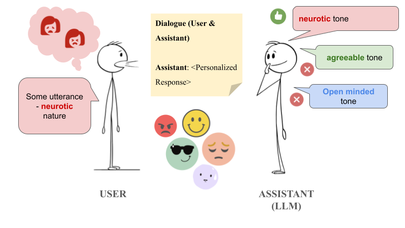

#  Beyond Discrete Personas: Personality Modeling Through Journal Intensive Conversations
[Sayantan Pal](https://sayantan-world.github.io/), [Souvik Das](https://www.acsu.buffalo.edu/~souvikda/), [Rohini K. Srihari](https://www.acsu.buffalo.edu/~rohini/)



<a href='https://sayantan-world.github.io/jic-coling-web/'></a>
<a href='https://arxiv.org/pdf/2412.11250'></a> 

This repository hosts the code for generating, fine-tuning, and evaluating the Journal Intensive Conversations [(JIC)](https://huggingface.co/datasets/chocokiddo/jic), dataset.

## TODOs
- [ ] Add RAFt code
- [ ] Add RAG code

## Setup
### Enviroment
1. Clone this repository and navigate to the correct folder
```bash
git clone https://github.com/Sayantan-world/Beyond-Discrete-Personas.git
cd Beyond-Discrete-Personas
```
2. Install Package (Please use conda, read more [here](https://docs.anaconda.com/miniconda/install/))
```Shell
conda env create -f environment.yml
```

3. Use the dataset (Read more about the dataset [JIC](https://huggingface.co/datasets/chocokiddo/jic))
```python
from datasets import load_dataset
dataset = load_dataset("chocokiddo/jic")
```

### Public Models (The models trained on a subset of the dataset is available publicly)
1. [LLaMAdelic](https://huggingface.co/choco58/LLaMAdelic)
2. [MistraMystic](https://huggingface.co/choco58/MistraMystic)

## Training

### Fine-tuning (Ft.)
We provide the fine-tuning scripts to reproduce the results of JIC, you can use the shell script in `Training/<model>` directory
```Shell
bash finetune.sh
```

### Retriever Augmented Fine-tuning (Ft.)
Coming soon

The detailed hyperparameters and settings can be found in the appendix of our paper.

## Evaluation

### Inference
After fine-tuning, you can evaluate its performance by running the following script in `Inference/<model>` directory:
```python
python infer.py
```

### RAG
Coming soon


## Contact
If you have any questions related to the code or the paper, feel free to contact [Sayantan Pal](spal5@buffalo.edu).


## Citation
If you find our work useful in your research, please consider citing JIC:
```bibtex
@misc{pal2024discretepersonaspersonalitymodeling,
        title={Beyond Discrete Personas: Personality Modeling Through Journal Intensive Conversations}, 
        author={Sayantan Pal and Souvik Das and Rohini K. Srihari},
        year={2024},
        eprint={2412.11250},
        archivePrefix={arXiv},
        primaryClass={cs.CL},
        url={https://arxiv.org/abs/2412.11250}, 
  }
```
